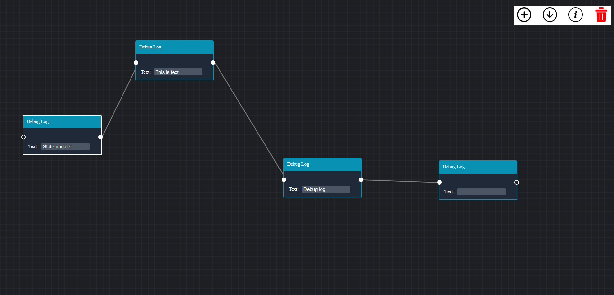

# Node Flow

Node Flow is Node based Interface where user can create nodes

## Live Project Link

[Node Flow](https://node-flow-connection.netlify.app/)

## Demo

Insert gif or link to demo

## Tech Stack

**Client:** ReactJS, HTML5, CSS3, JavaScript

## Features

- Create Node
- Delete Node
- Make Connection between nodes
- Change order sequence
- Download and Save Node Graph for later access

## Feedback

If you have any feedback, please reach out to us at any of the given socials.

## 🔗 Links

